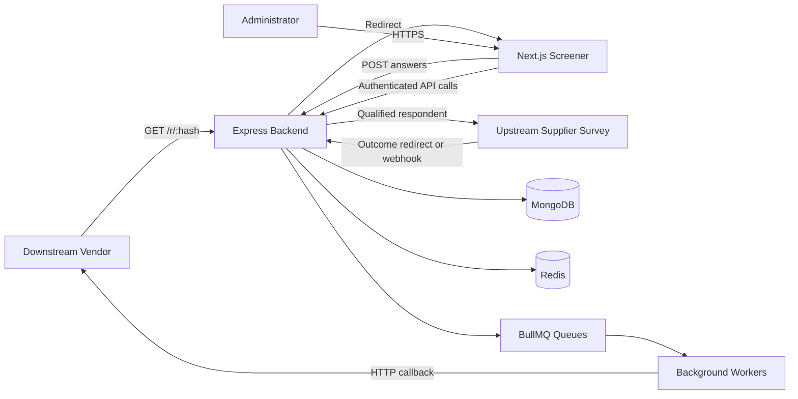

# Route-Bridge Documentation

Route-Bridge is a full-stack survey traffic-routing and redirect-management platform. It connects downstream vendors that supply respondents with upstream suppliers that host surveys, evaluates respondent eligibility, tracks transaction outcomes, and sends status callbacks back to vendors.

The repository contains two applications:

- `frontend/`: Next.js administrative dashboard and respondent-facing screener UI.
- `backend/`: Node.js and Express API, redirect bridge, persistence layer, cache, queues, workers, and mock endpoints used for end-to-end testing.

> This document describes the repository as implemented on the `caching` branch. Verify deployment-specific values and endpoint behavior against the source before integrating with an external vendor.

## Table of Contents

- [Product Overview](#product-overview)
- [Architecture](#architecture)
- [End-to-End Request Flow](#end-to-end-request-flow)
- [Repository Layout](#repository-layout)
- [Prerequisites](#prerequisites)
- [Local Development](#local-development)
- [Environment Configuration](#environment-configuration)
- [Authentication and Authorization](#authentication-and-authorization)
- [Core Domain Concepts](#core-domain-concepts)
- [API Reference](#api-reference)
- [Background Processing and Caching](#background-processing-and-caching)
- [Frontend Guide](#frontend-guide)
- [End-to-End Testing](#end-to-end-testing)
- [Docker and Deployment](#docker-and-deployment)
- [Security and Operations](#security-and-operations)
- [Troubleshooting](#troubleshooting)
- [Contributing](#contributing)

## Product Overview

Route-Bridge manages the lifecycle of a respondent moving through a market-research survey:

1. A vendor sends a respondent to a unique survey link.
2. Route-Bridge validates the link and displays the survey screener.
3. The screener evaluates configured eligibility rules.
4. Qualified respondents are forwarded to the supplier's survey URL.
5. The supplier returns a completion or termination outcome.
6. Route-Bridge records the outcome and asynchronously notifies the vendor through its configured callback URL.
7. Administrators monitor suppliers, vendors, surveys, transactions, and dashboard metrics.

The platform supports the following outcomes:

- `started`
- `completed`
- `screened_out`
- `quota_full`
- `terminate`
- `security_term`
- `fraud`

## Architecture



### Backend responsibilities

- Express HTTP server and route registration.
- Passwordless email OTP authentication.
- JWT cookie validation and administrator authorization.
- Survey routing and screener eligibility evaluation.
- Transaction creation and outcome updates.
- MongoDB persistence through Mongoose.
- Redis caching and BullMQ queue infrastructure.
- Vendor callback delivery through background workers.
- Mock supplier and mock vendor endpoints for local E2E testing.

### Frontend responsibilities

- Administrator sign-in and OTP verification screens.
- Dashboard for transaction metrics and recent activity.
- Supplier, vendor, and survey management screens.
- Survey configuration, eligibility rules, and vendor-link administration.
- Respondent-facing screener pages.
- Client-side API access through the configured backend URL.

## End-to-End Request Flow

### 1. Vendor entry link

Each survey/vendor relationship has a secure hash. A vendor receives a link in this form:

```text
http://<backend-host>/r/<survey-hash>?vendor_rid=<vendor-respondent-id>
```

The backend uses the hash to locate the matching vendor link and active survey, then redirects the respondent to the frontend screener:

```text
http://<frontend-host>/screener/<survey-hash>?vendor_rid=<vendor-respondent-id>
```

`vendor_rid` is preserved throughout the journey so the final vendor callback can identify the respondent.

### 2. Screener evaluation

The frontend loads the screener configuration from the backend. The configuration contains the survey's eligibility rules. When the respondent submits answers, the backend evaluates them:

- If the answers do not qualify, a transaction is recorded as `screened_out`.
- If the answers qualify, a transaction is recorded as `started`, a transaction token is generated, and the respondent is forwarded to the supplier URL.

The survey's `baseSupplierUrl` must contain the `[identifier]` placeholder. Route-Bridge replaces that placeholder with the transaction token before redirecting the respondent.

Example:

```text
Configured: https://supplier.example/survey?uid=[identifier]
Generated:  https://supplier.example/survey?uid=<transaction-token>
```

### 3. Supplier outcome

A supplier can return an outcome through the legacy redirect bridge:

```text
/l/complete?uid=<transaction-token>&pid=<project-id>
/l/terminate?uid=<transaction-token>&pid=<project-id>
/l/quotafull?uid=<transaction-token>&pid=<project-id>
/l/securityterm?uid=<transaction-token>&pid=<project-id>
```

The `/i/*` path is also supported as a legacy alias for `/l/*`. Server-to-server supplier notifications are supported through:

```text
POST /api/webhooks/supplier/:supplierId
```

The backend finds the transaction, updates its status, and queues asynchronous follow-up work.

### 4. Vendor callback

The webhook worker selects the vendor URL associated with the final status and sends an HTTP GET request. Vendor URL macros can include:

- `{{vendor_rid}}`: replaced with the original vendor respondent ID.
- `{{status}}`: replaced with the resulting transaction status where supported.

Status-specific callback fields are available for completion, termination, quota-full, and security-termination outcomes.

## Repository Layout

```text
Route-Bridge/
├── backend/
│   ├── src/
│   │   ├── config/          # MongoDB, Redis, and BullMQ configuration
│   │   ├── controllers/     # HTTP request handlers
│   │   ├── helpers/         # Shared response/template helpers
│   │   ├── middleware/      # Authentication, admin, errors, and request middleware
│   │   ├── models/          # Mongoose models
│   │   ├── routes/          # Express route modules
│   │   ├── services/        # Business logic for routing, screening, and surveys
│   │   ├── workers/         # BullMQ consumers and scheduled cache jobs
│   │   └── index.mjs        # Backend entry point
│   ├── public/              # Backend-served public assets
│   ├── .env.example         # Backend environment template
│   ├── Dockerfile           # Backend container image
│   └── package.json
├── frontend/
│   ├── app/                 # Next.js App Router pages and providers
│   │   ├── dashboard/       # Protected administrator dashboard
│   │   ├── screener/        # Respondent-facing screener
│   │   ├── signin/          # Passwordless sign-in flow
│   │   ├── context/         # Application context/providers
│   │   └── store/            # Redux store setup
│   ├── components/          # Shared UI and dashboard components
│   ├── hooks/               # Reusable React hooks
│   ├── lib/                 # Client utilities and API helpers
│   ├── public/              # Static frontend assets
│   ├── .env.example         # Frontend environment template
│   ├── Dockerfile           # Frontend container image
│   └── package.json
├── BUGS.md                  # Known bug and risk analysis
├── TEST.md                  # Manual end-to-end test procedure
└── README.md                # High-level project notes
```

## Prerequisites

Install the following before running the applications locally:

- Node.js compatible with the versions used by the project dependencies.
- npm.
- MongoDB, either locally or through MongoDB Atlas.
- Redis, required for caching and BullMQ queues.
- An SMTP-compatible mailbox for OTP delivery, unless email sending is mocked.

MongoDB and Redis must be reachable from the backend process. The frontend and backend run independently during local development.

## Local Development

### 1. Clone and enter the repository

```bash
git clone https://github.com/Himaanshuuuu04/Route-Bridge.git
cd Route-Bridge
```

### 2. Configure the backend

```bash
cd backend
cp .env.example .env
npm install
```

Edit `.env` with valid MongoDB, Redis, JWT, and mail settings.

Start the backend in development mode:

```bash
npm run dev
```

The default backend port is `5000`.

### 3. Configure the frontend

In a second terminal:

```bash
cd frontend
cp .env.example .env.local
npm install
npm run dev
```

The default frontend URL is `http://localhost:3000`.

For local development, set `NEXT_PUBLIC_API_URL` to the backend API origin or API prefix used by the local proxy, for example:

```dotenv
NEXT_PUBLIC_API_URL=http://localhost:5000/api
```

If the frontend and backend are served behind one reverse proxy, `/api` can be used instead.

### 4. Production-style commands

Backend:

```bash
npm start
```

Frontend:

```bash
npm run build
npm start
```

Frontend linting:

```bash
npm run lint
```

The backend package currently contains a placeholder `test` script; use the manual workflow in [`TEST.md`](../TEST.md) for the documented E2E checks.

## Environment Configuration

### Backend variables

| Variable | Purpose | Example |
|---|---|---|
| `PORT` | HTTP port for Express | `5000` |
| `NODE_ENV` | Runtime environment | `development` |
| `FRONTEND_URL` | Frontend origin used for redirects and CORS | `http://localhost:3000` |
| `JWT_SECRET` | Secret used to sign authentication tokens | Long random secret |
| `MONGODB_URI` | MongoDB connection string | `mongodb://localhost:27017/route_bridge` |
| `REDIS_URL` | Redis connection string | `redis://localhost:6379` |
| `EMAIL_HOSTINGER_USER` | SMTP account used for OTP email | `auth@example.com` |
| `EMAIL_HOSTINGER_PASSWORD` | SMTP account password | Secret value |
| `COMPANY_NAME` | Brand name in outgoing email | `EvoGlobalInsight` |
| `ADMIN_EMAIL` | Administrative email configuration | `admin@example.com` |
| `COOKIE_SAME_SITE` | Cookie SameSite policy | `lax` |
| `COOKIE_DOMAIN` | Optional cookie domain for deployment | `example.com` |

Never commit real credentials, JWT secrets, SMTP passwords, database URLs, or Redis credentials. Keep `.env` files outside version control.

### Frontend variables

| Variable | Purpose | Example |
|---|---|---|
| `NEXT_PUBLIC_API_URL` | Backend API base URL used by the browser | `/api` or `http://localhost:5000/api` |

Because this variable is public in a Next.js build, it must not contain credentials or private secrets.

## Authentication and Authorization

Route-Bridge uses passwordless email authentication:

1. A user signs up with an email address and name.
2. The user requests a sign-in OTP.
3. The backend generates a time-limited OTP and queues an email.
4. The user submits the OTP.
5. The backend issues a JWT in an HTTP-only cookie named `token`.
6. Protected requests use the cookie for authentication.
7. Administrator-only routes additionally require the authenticated user's `surveyAdmin` flag.

Expected authorization behavior:

- Missing or invalid authentication: `401 Unauthorized`.
- Authenticated non-administrator accessing admin functionality: `403 Forbidden`.
- Invalid authentication cookies should be cleared by the backend.

Use HTTPS in non-local environments so authentication cookies and respondent identifiers are not exposed in transit.

## Core Domain Concepts

### User

Represents an administrator or platform user. Important fields include `email`, `name`, OTP data, and `surveyAdmin`.

### Supplier

Represents the upstream organization that hosts the actual survey. Suppliers may have an optional postback URL and active/inactive state.

### Vendor

Represents the downstream traffic source. A vendor is configured with status-specific callback URLs:

- `completeUrl`
- `terminateUrl`
- `quotaFullUrl`
- `securityTermUrl`

### Survey

Defines the project being routed. A survey contains its supplier, project ID, active/paused/closed status, optional country filtering, eligibility rules, base supplier URL, and vendor links.

### Vendor link

A survey can have multiple vendor links. Each link contains a vendor reference, secure hash, and quota. The hash is used to create the respondent entry URL.

### Transaction

Represents one respondent journey. It connects the survey, supplier context, vendor, vendor respondent ID, transaction token, geographic metadata, status, and timestamps.

## API Reference

The following endpoint groups are implemented by the backend. Protected routes require the authentication cookie; administration routes also require administrator access.

### User authentication: `/api/user`

| Method | Endpoint | Purpose |
|---|---|---|
| `POST` | `/signUp` | Create a user with an email and name |
| `POST` | `/signIn` | Generate and email a one-time password |
| `POST` | `/verifyOtp` | Validate the OTP and issue the JWT cookie |

### Traffic routing

| Method | Endpoint | Purpose |
|---|---|---|
| `GET` | `/r/:hash?vendor_rid=<id>` | Validate a vendor link and redirect to the screener |

### Screener: `/api/screener`

| Method | Endpoint | Purpose |
|---|---|---|
| `GET` | `/config/:hash` | Load screener rules and evaluate repeat-visit state |
| `POST` | `/submit` | Evaluate answers and create a transaction |

Example submission:

```json
{
  "hash": "survey-vendor-hash",
  "vendor_rid": "VENDOR_RID_123",
  "answers": {
    "age": "25",
    "gender": "Male"
  }
}
```

### Supplier outcomes

| Method | Endpoint | Resulting status |
|---|---|---|
| `GET`/`POST` | `/l/complete` or `/i/complete` | `completed` |
| `GET`/`POST` | `/l/terminate` or `/i/terminate` | `terminate` |
| `GET`/`POST` | `/l/quotafull` or `/i/quotafull` | `quota_full` |
| `GET`/`POST` | `/l/securityterm` or `/i/securityterm` | `security_term` |
| `POST` | `/api/webhooks/supplier/:supplierId` | Supplier webhook processing |

The redirect bridge accepts `uid` for the transaction token and `pid` for the project identifier.

### Administration: `/api/admin/surveys`

Administration routes cover:

- Supplier listing, creation, and deletion.
- Vendor listing, creation, and deletion.
- Survey listing, creation, retrieval, update, and deletion.
- Transaction listing, search, and deletion.

Survey creation accepts the survey name, project ID, supplier, base supplier URL, IP filtering configuration, allowed countries, eligibility rules, and vendor links.

### Dashboard: `/api/dashboard`

| Method | Endpoint | Purpose |
|---|---|---|
| `GET` | `/getcount` | Total and status-based transaction counts |
| `GET` | `/getRecentSurveys` | Recent transaction activity |
| `GET` | `/getCompletedSurveys` | Completed transactions |
| `GET` | `/getTerminatedSurveys` | Terminated transactions |
| `GET` | `/getQuotaFullSurveys` | Quota-full transactions |
| `GET` | `/getSecurityTermSurveys` | Security-terminated transactions |
| `DELETE` | `/remove/:id` | Remove a transaction |
| `PUT` | `/update/:id` | Manually update a transaction status |

### Mock testing endpoints

| Method | Endpoint | Purpose |
|---|---|---|
| `GET` | `/mock-supplier` | Simulate supplier outcome buttons |
| `GET` | `/mock-vendor-callback/complete` | Receive a simulated completion callback |
| `GET` | `/mock-vendor-callback/terminate` | Receive a simulated termination callback |
| `GET` | `/mock-vendor-callback/quotafull` | Receive a simulated quota-full callback |
| `GET` | `/mock-vendor-callback/securityterm` | Receive a simulated security-term callback |

## Background Processing and Caching

Redis supports both caching and BullMQ queues.

### Webhook queue

The webhook worker sends vendor postbacks after transaction outcomes are recorded. Keeping callback delivery asynchronous prevents a slow or unavailable vendor endpoint from blocking the respondent's browser request.

### Dashboard cache queue

The dashboard cache worker rebuilds metrics and recent-transaction views after transaction changes. Cached data includes dashboard statistics, recent transactions, and status-specific lists.

### Email queue

The email worker sends transactional messages such as sign-in OTPs.

### Operational considerations

- Redis availability is required for queue processing and cache-backed paths.
- Queue workers must run in the deployment environment; starting only the HTTP process is insufficient for email and webhook delivery.
- Monitor queue failures and retry behavior.
- Treat cached dashboard data as eventually consistent with MongoDB.
- Review [`BUGS.md`](../BUGS.md) before production deployment, especially the Redis key-scanning and cache-ordering findings.

## Frontend Guide

The frontend is a Next.js App Router application using TypeScript, React, Redux Toolkit, Axios, Tailwind CSS, shadcn-oriented components, Recharts, and Framer Motion.

Important areas:

- `app/signin/`: passwordless authentication UI.
- `app/dashboard/`: protected administration experience.
- `app/screener/`: respondent eligibility flow.
- `app/store/`: Redux store configuration.
- `components/`: reusable UI and dashboard components.
- `hooks/`: reusable client hooks.
- `lib/`: API and utility functions.
- `proxy.ts`: request/proxy behavior for frontend routing and API access.

When adding a new protected dashboard feature:

1. Add the page or component under the dashboard route tree.
2. Add API access through the existing client utilities.
3. Preserve cookie-based authentication behavior.
4. Add loading, empty, error, and unauthorized states.
5. Run `npm run lint` and `npm run build` from `frontend/`.

## End-to-End Testing

The repository includes a complete manual workflow in [`TEST.md`](../TEST.md). The short version is:

1. Start MongoDB, Redis, backend, and frontend.
2. Create a test vendor whose callback URLs point to the mock callback endpoints.
3. Create a test supplier.
4. Create an active survey using the mock supplier URL and eligibility rules.
5. Copy the generated vendor redirect link.
6. Test incorrect screener answers and verify `screened_out`.
7. Test correct answers and verify the supplier redirect creates a `started` transaction.
8. Select Complete, Terminate, Quota Full, and Security Term on the mock supplier page.
9. Verify the transaction status, backend logs, and mock vendor callback.

Example mock supplier URL:

```text
http://localhost:5000/mock-supplier?uid=[identifier]&pid=PROJ-TEST-01
```

Keep `[identifier]` unchanged in the survey configuration; the backend replaces it with the generated transaction token.

## Docker and Deployment

Both applications include Dockerfiles. A typical deployment should provide:

- A frontend container.
- A backend HTTP container.
- One or more backend worker processes.
- MongoDB.
- Redis.
- A reverse proxy or platform routing layer if frontend and backend share a public domain.

Before deployment:

1. Set a strong, unique `JWT_SECRET`.
2. Configure production MongoDB and Redis URLs.
3. Set the exact public frontend URL in `FRONTEND_URL`.
4. Configure `NEXT_PUBLIC_API_URL` for the public routing topology.
5. Configure secure cookie settings and HTTPS.
6. Restrict CORS to trusted origins.
7. Confirm that worker processes are running.
8. Disable or restrict mock endpoints if they are not needed in production.
9. Add monitoring for HTTP errors, queue failures, MongoDB connectivity, Redis connectivity, and callback response codes.
10. Run the documented E2E flow against a staging environment.

## Security and Operations

- Do not expose `.env` files or secrets in logs.
- Use HTTPS for all public traffic.
- Use HTTP-only, secure cookies in production.
- Validate and constrain vendor callback destinations to reduce SSRF risk.
- Apply rate limits to authentication, screener submission, and public redirect endpoints.
- Validate callback signatures or shared secrets when integrating with suppliers that support them.
- Avoid logging complete respondent identifiers or tokens unless required for debugging, and redact them in centralized logs.
- Keep MongoDB and Redis on private networks where possible.
- Apply least-privilege credentials for application and worker processes.
- Review status transitions and prevent unauthorized manual transaction changes.
- Treat webhook delivery as retryable and idempotent; a repeated callback must not create duplicate business effects.

## Troubleshooting

### Frontend cannot reach the backend

- Confirm `NEXT_PUBLIC_API_URL`.
- Confirm that the backend is running on the expected port.
- Check browser network requests and CORS configuration.
- If using `/api`, verify the reverse proxy forwards `/api` to Express.

### OTP email is not received

- Verify SMTP credentials and mailbox configuration.
- Check backend logs and the email queue worker.
- Confirm the recipient address exists and is not blocked by the mail provider.

### Dashboard data is stale

- Confirm Redis is reachable.
- Confirm the dashboard cache worker is running.
- Check BullMQ failures and worker logs.
- Compare the cached response with the MongoDB transaction records.

### Vendor callback is missing

- Confirm the correct status-specific URL is configured on the vendor.
- Verify the transaction reached its final status.
- Check the webhook queue and worker logs.
- Test the callback URL independently with the expected `vendor_rid` value.

### The supplier redirect is malformed

- Confirm `baseSupplierUrl` contains exactly `[identifier]`.
- Confirm the supplier expects the transaction token in the configured query parameter.
- Confirm that the survey and vendor link are active.

### Local E2E test does not progress

- Verify the mock supplier uses the backend port, normally `5000`.
- Verify the frontend is available on `3000`.
- Confirm the test vendor URLs point to `/mock-vendor-callback/*`.
- Follow the exact setup order in `TEST.md`.

## Contributing

1. Create a focused branch from the current default branch.
2. Keep frontend and backend changes scoped to one feature or fix.
3. Update this documentation when routes, environment variables, workflows, or deployment behavior changes.
4. Add or update automated tests where practical; use the manual E2E workflow for redirect and callback integration behavior.
5. Run frontend lint/build checks and manually verify affected backend flows.
6. Do not commit secrets, local database dumps, generated build output, or personal environment files.
7. Include migration, rollout, and rollback notes for data-model or queue changes.

## Related Documentation

- [`README.md`](../README.md): Existing high-level platform notes and lifecycle description.
- [`backend/README.md`](../backend/README.md): Existing backend API and model notes.
- [`frontend/README.md`](../frontend/README.md): Next.js application notes.
- [`TEST.md`](../TEST.md): Manual end-to-end verification procedure.
- [`BUGS.md`](../BUGS.md): Known bug and risk analysis.
